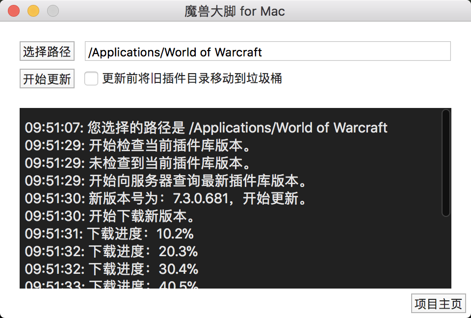

## 魔兽大脚 For Mac

一个在 macOS 系统上安装、更新魔兽大脚插件的小程序。

### 系统要求
macOS 10.11 及以上系统版本。仅在 macOS 10.13 测试过。

### 使用步骤
1. 点击【选择路径】按钮选择游戏的根目录。
2. 点击【开始更新】按钮，程序将会自动获取服务器最新版本的插件并安装到本地。
3. 各种错误信息可以查看下方的控制台输出。

#### 关于【更新前将旧插件目录移动到垃圾桶】选项
- 如果在解压操作开始之前勾选了该选项，程序会在将插件解压到 `/Interface/AddOns` 之前，把 `AddOns` 目录移到到垃圾桶。
- 如果不勾选该选项，在解压过程中，若两个文件或目录的名称相同，新的会覆盖旧的。也就是说会保留你额外添加的，不包含在大脚里的那些插件，但其他的全部会覆盖掉。

### 下载
- [百度盘](https://pan.baidu.com/s/1aSfV8c6kTtM1Oc_1vrrTjA)
- [GitHub Release](https://github.com/VincentSit/BigFootWoW/releases)

其他源下载请注意安全。

### 免责声明
- 该程序不需要管理员权限，不涉及敏感操作。所有源代码公开在 [Github](https://github.com/VincentSit/BigFootWoW) 上。
- 除访问魔兽大脚下载页面外，不发送其他网络请求，更没有上传功能。
- 该程序只是个人用途，开发者不承担因为程序 Bug 等原因造成的任何不良后果。请谨慎使用。
- 下载或运行该程序表明您已完全理解并同意以上声明。

### 版本历史
2018.03.17
	第一次发布。
	

### License
MIT

